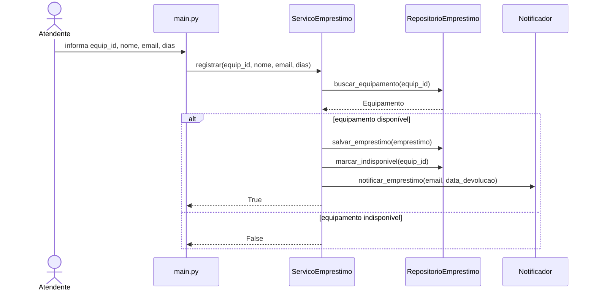
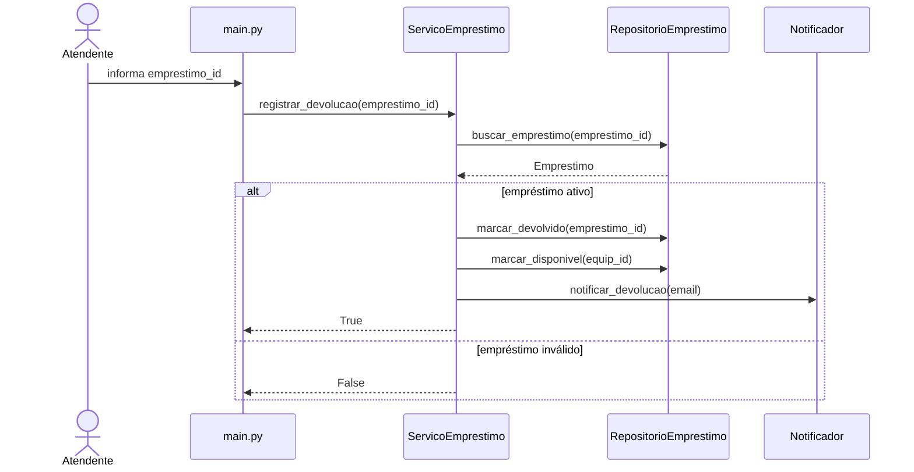
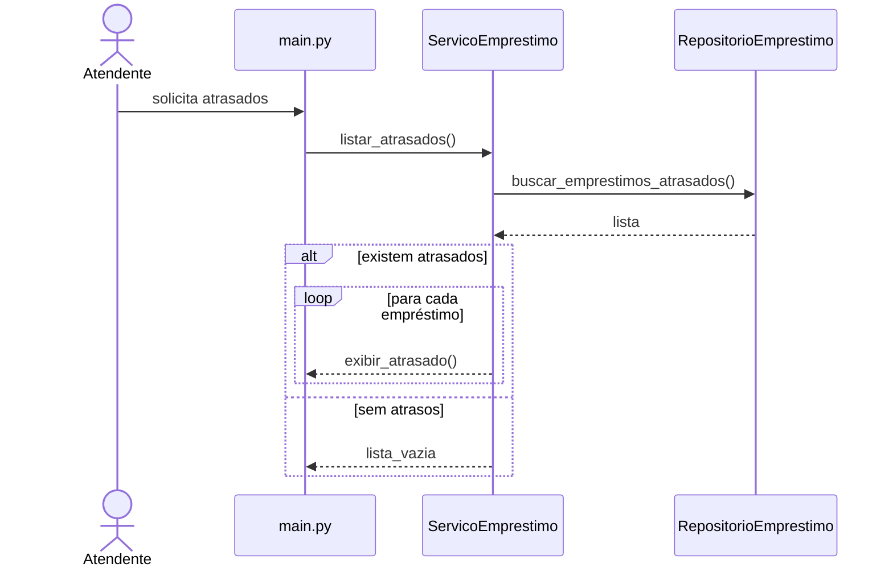

# Diagramas e Decomposição em Camadas — Atividade 4a

**Aluno:** Alex da Silva Oliveira  
**Disciplina:** Engenharia de Software II  
**Professor:** Fabrício Araújo  

---

# Decomposição em Camadas

## models/Equipamento
Representa a entidade de domínio Equipamento, armazenando seus dados e disponibilidade.

## models/Emprestimo
Representa o contrato de empréstimo, contendo usuário, datas e status.

## services/ServicoEmprestimo
Centraliza regras de negócio de empréstimo, devolução e atrasos.

## services/Notificador
Responsável exclusivamente pelas notificações.

## repositories/RepositorioEmprestimo
Gerencia armazenamento, busca e atualização de dados.

## main.py
Responsável pela interface CLI e interação com usuário.

---

# Diagramas de Sequência

## UC01 — Registrar Empréstimo

## UC02 — Registrar Devolução

## UC03 — Listar Empréstimos em Atraso

